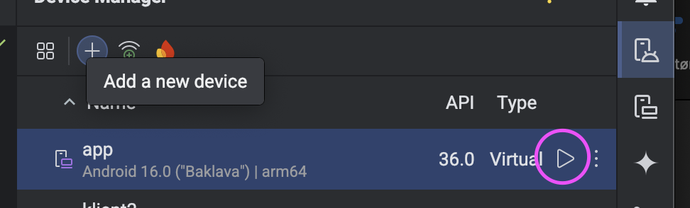

# Fast Grocery/To-Do List App (Flutter)

This project is a cross-platform mobile application developed using **Flutter**.
## ✨ Features

The List application contains the following features:

* Adding and deleting lists.
* Adding and deleting list items.
* Manually **reordering** list items with a long press (Drag-and-Drop).
* Switching between **Light Mode** and **Dark Mode**.

---

## 🚀 How to Test the Solution on an Android Emulator

Follow these steps to set up your environment and run the application on a virtual Android device.

1.  Make sure you have installed **Flutter SDK** on your computer: [Download](https://docs.flutter.dev/get-started)
2.  Download the project locally on your machine and open it with **Android Studio**: [Download](https://developer.android.com/studio)
3. Check that the Flutter Plugin is downloaded in Android Studio.

### 📱 Emulator Setup

1. In Android Studio, navigate to the **Device Manager** located on the right edge of the screen.
2. Create a new device or run an existing one from the list. *Note: The application was developed and tested on a "generic medium_phone" running with Android 16.0 ("Baklava")*
3. Start the emulator by clicking the play icon next to the device in the list.



### ▶️ Running the Project

1. Open your terminal and navigate to the project's root directory.
2. Run the project with the command:

```bash
flutter run